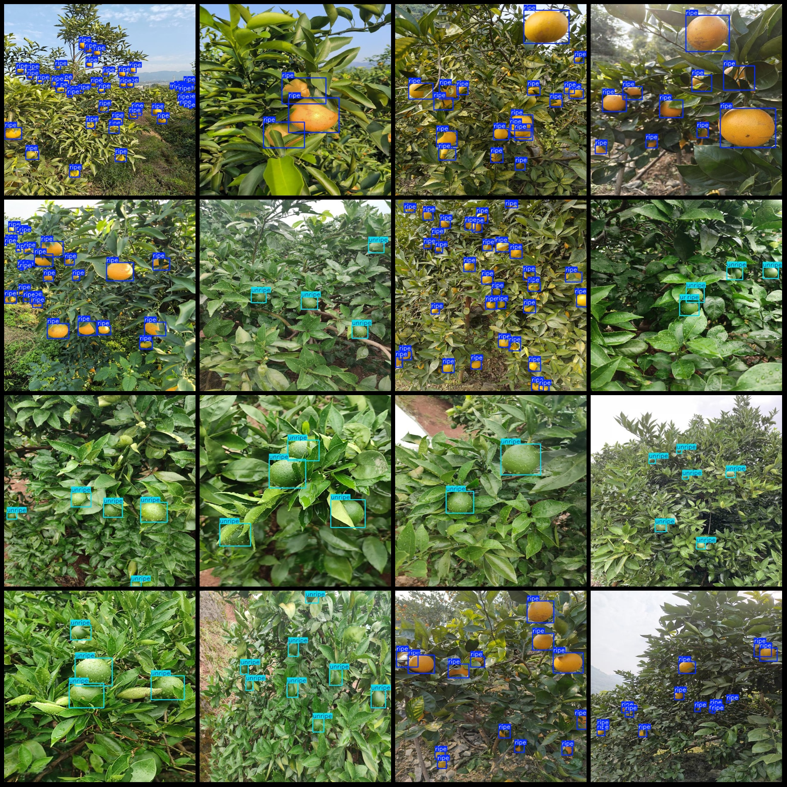
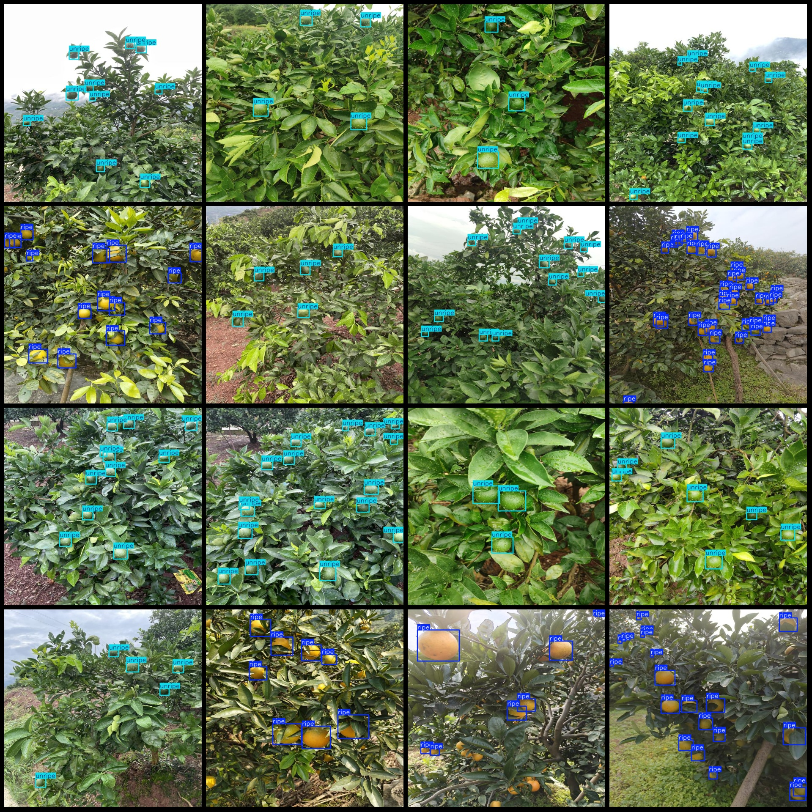

# Smart orchard citrus fruit maturity detection dataset VOC+YOLO format: 1566 images, 2 categories

Dataset format: Pascal VOC format + YOLO format (txt files without split paths, only containing jpg images, corresponding VOC format xml files, and yolo format txt files)
Number of images (jpg file count): 1566
Number of annotations (xml file count): 1566
Number of annotations (txt file count): 1566
Number of annotation categories: 2
Annotation category names in yolo format: ["ripe", "unripe"]
Each category number of bounding boxes:
Ripe: 16,806
Unripe: 5,465
Total bounding boxes: 22,271
Number of images per category:
Ripe: 790
Unripe: 780
Image resolution: 640x640
Annotation tool used: labelImg
Annotation rules: drawing bounding boxes for categories
Important note: The dataset does not have a training validation test split; it must be divided by the user.
Special declaration: This dataset does not guarantee the accuracy of the trained models or weight files.
Image preview:
Annotation example:

## Images

Here is a pay link on Stripe ( https://buy.stripe.com/3cs8yP7sY87d0vu9AB ). Please contact me lonlonago@foxmail.com after funding $89, and I will send you a complete data files , thank you!

